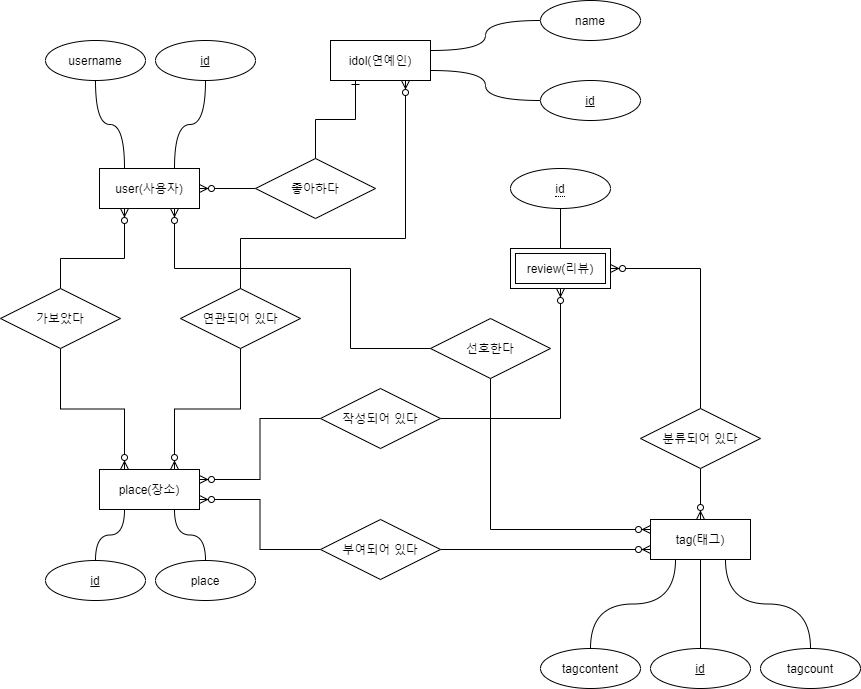

# Idol-master
> 캡스톤 융합 디자인 프로젝트. 팀명 팔로잉
## 1. 데이터베이스 설계
### 1.1. ERD

### 1.2. CREATE 코드
```SQL
    CREATE TABLE `idol` (
        `id` BIGINT(20) UNSIGNED NOT NULL AUTO_INCREMENT,
        `name` VARCHAR(50) NOT NULL COMMENT '아이돌 이름' COLLATE 'utf8mb4_general_ci',
        PRIMARY KEY (`id`) USING BTREE
    )
    COLLATE='utf8mb4_general_ci'
    ENGINE=InnoDB
    AUTO_INCREMENT=0
    ;

    CREATE TABLE `place` (
	`id` BIGINT(20) UNSIGNED NOT NULL AUTO_INCREMENT,
	`place` VARCHAR(50) NOT NULL COMMENT '장소의 이름' COLLATE 'utf8mb4_general_ci',
	PRIMARY KEY (`id`) USING BTREE
    )
    COLLATE='utf8mb4_general_ci'
    ENGINE=InnoDB
    AUTO_INCREMENT=0
    ;

    CREATE TABLE `place_tag` (
        `place_id` BIGINT(20) UNSIGNED NOT NULL,
        `tag_id` BIGINT(20) UNSIGNED NOT NULL,
        INDEX `FK__place` (`place_id`) USING BTREE,
        INDEX `FK_place_tag_tag` (`tag_id`) USING BTREE,
        CONSTRAINT `FK__place` FOREIGN KEY (`place_id`) REFERENCES `following`.`place` (`id`) ON UPDATE RESTRICT ON DELETE RESTRICT,
        CONSTRAINT `FK_place_tag_tag` FOREIGN KEY (`tag_id`) REFERENCES `following`.`tag` (`id`) ON UPDATE RESTRICT ON DELETE RESTRICT
    )
    COMMENT='M:N테이블'
    COLLATE='utf8mb4_general_ci'
    ENGINE=InnoDB
    ;

    CREATE TABLE `review` (
        `id` BIGINT(20) UNSIGNED NOT NULL AUTO_INCREMENT,
        `palce_id` BIGINT(20) UNSIGNED NULL DEFAULT NULL COMMENT '어떤 장소에 달린 리뷰인지',
        `writer_id` BIGINT(20) UNSIGNED NOT NULL COMMENT '글쓴이',
        `content` TEXT(65535) NOT NULL COMMENT '내용' COLLATE 'utf8mb4_general_ci',
        PRIMARY KEY (`id`) USING BTREE,
        INDEX `FK_review_user` (`writer_id`) USING BTREE,
        INDEX `FK_review_place` (`palce_id`) USING BTREE,
        CONSTRAINT `FK_review_place` FOREIGN KEY (`palce_id`) REFERENCES `following`.`place` (`id`) ON UPDATE RESTRICT ON DELETE RESTRICT,
        CONSTRAINT `FK_review_user` FOREIGN KEY (`writer_id`) REFERENCES `following`.`user` (`id`) ON UPDATE RESTRICT ON DELETE RESTRICT
    )
    COLLATE='utf8mb4_general_ci'
    ENGINE=InnoDB
    AUTO_INCREMENT=0
    ;

    CREATE TABLE `review_tag` (
        `review_id` BIGINT(20) UNSIGNED NOT NULL,
        `tag_id` BIGINT(20) UNSIGNED NOT NULL,
        INDEX `FK_review_tag_tag` (`tag_id`) USING BTREE,
        INDEX `FK__review` (`review_id`) USING BTREE,
        CONSTRAINT `FK__review` FOREIGN KEY (`review_id`) REFERENCES `following`.`review` (`id`) ON UPDATE RESTRICT ON DELETE RESTRICT,
        CONSTRAINT `FK_review_tag_tag` FOREIGN KEY (`tag_id`) REFERENCES `following`.`tag` (`id`) ON UPDATE RESTRICT ON DELETE RESTRICT
    )
    COMMENT='M:N테이블'
    COLLATE='utf8mb4_general_ci'
    ENGINE=InnoDB
    ;

    CREATE TABLE `tag` (
        `id` BIGINT(20) UNSIGNED NOT NULL AUTO_INCREMENT,
        `tagcontent` VARCHAR(50) NOT NULL COMMENT '태그 내용' COLLATE 'utf8mb4_general_ci',
        `tagcount` INT(11) UNSIGNED NOT NULL COMMENT '태그된 횟수',
        PRIMARY KEY (`id`) USING BTREE
    )
    COLLATE='utf8mb4_general_ci'
    ENGINE=InnoDB
    AUTO_INCREMENT=0
    ;

    CREATE TABLE `user` (
        `id` BIGINT(20) UNSIGNED NOT NULL AUTO_INCREMENT,
        `username` VARCHAR(50) NOT NULL DEFAULT '' COMMENT '유저 id' COLLATE 'utf8mb4_general_ci',
        `fandom` BIGINT(20) UNSIGNED NOT NULL DEFAULT '0' COMMENT '좋아하는 연예인',
        `favorite` BIGINT(20) UNSIGNED NOT NULL DEFAULT '0' COMMENT '취향',
        `visited` BIGINT(20) UNSIGNED NULL DEFAULT NULL COMMENT '방문한 장소',
        PRIMARY KEY (`id`) USING BTREE,
        INDEX `FK_user_idol` (`fandom`) USING BTREE,
        INDEX `FK_user_tag` (`favorite`) USING BTREE,
        INDEX `FK_user_place` (`visited`) USING BTREE,
        CONSTRAINT `FK_user_idol` FOREIGN KEY (`fandom`) REFERENCES `following`.`idol` (`id`) ON UPDATE RESTRICT ON DELETE RESTRICT,
        CONSTRAINT `FK_user_place` FOREIGN KEY (`visited`) REFERENCES `following`.`place` (`id`) ON UPDATE RESTRICT ON DELETE RESTRICT,
        CONSTRAINT `FK_user_tag` FOREIGN KEY (`favorite`) REFERENCES `following`.`tag` (`id`) ON UPDATE RESTRICT ON DELETE RESTRICT
    )
    COLLATE='utf8mb4_general_ci'
    ENGINE=InnoDB
    AUTO_INCREMENT=0
    ;
```
## 2. 인공지능 설계
FastText 사용
### 2.1. 학습된 데이터

### 2.2. 형태소 분석기
꼬꼬마 형태소 분석기 사용.

## 3. RestFul api 설계
### 3.1. 요청 방식
[REST Request Method](restful.md)
### 3.2. 서블릿 설계
JSP 사용
